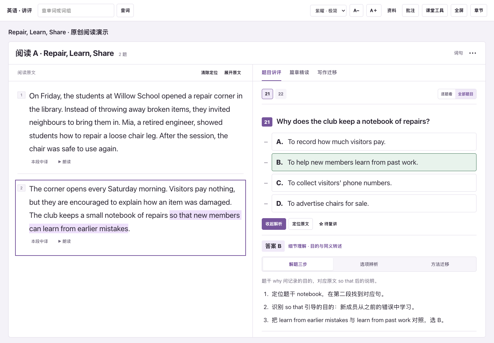
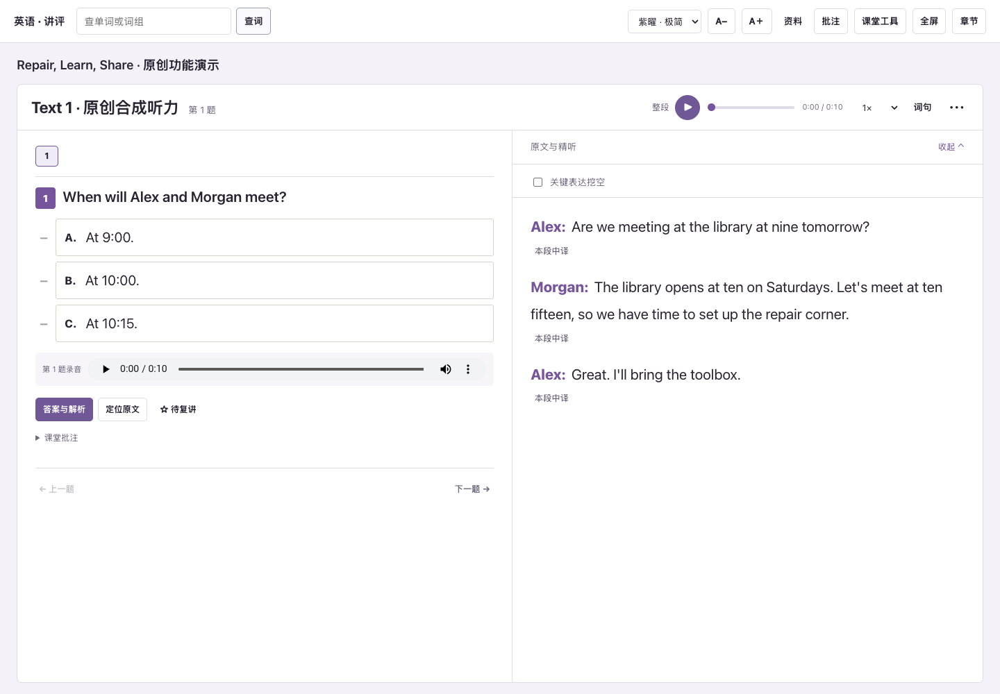

# 英语实战讲评 Skill

**把试卷、参考答案和听力音频交给你的 Agent，生成一套老师能直接打开讲课的整卷 HTML 课件。**

听力可以整段听、按题听、慢速精听；阅读可以一边看原文，一边逐题讲依据、讲方法，再把值得积累的表达迁移到写作。

由 [图图 · hututu-ai](https://github.com/hututu-ai) 制作，免费开源。你可以直接使用，也可以和 Agent 讨论自己的教学习惯，修改后保存成自己的 Skill，下次换卷继续用。

[**下载 Skill 安装包**](https://github.com/hututu-ai/english-exam-studio/releases/latest/download/english-exam-studio.zip) · [查看最新版本](https://github.com/hututu-ai/english-exam-studio/releases/latest) · [常见问题](docs/FAQ.md) · [反馈问题](https://github.com/hututu-ai/english-exam-studio/issues)

## 第一次来，先看这三句话

1. **Skill 是交给 AI 助手使用的备课流程。** 需要一个支持安装技能、读取文件和运行工具的 Agent；普通聊天窗口能否使用，取决于它是否具备这些能力。
2. **老师主要负责提供材料和说明习惯。** 识别试卷、整理题目、写解析、处理音频、生成网页，由 Agent 按 Skill 执行。老师不用先学写代码或手动切录音。
3. **生成后拿到的是课件文件。** 用浏览器打开 `index.html` 上课；基础讲评不需要给网页另填 AI API，完整课件文件夹可以离线带到教室。

想先看看成品，可以从 [最新版本](https://github.com/hututu-ai/english-exam-studio/releases/latest) 下载 `english-exam-demo.zip`，解压后打开里面的 `index.html`。公开示例使用原创阅读材料，用于先体验讲评界面；真实试卷的全部讲解和听力由你提供的材料决定。

## 成品长什么样



*图中为原创演示材料。真实生成时按你的原卷保留全部题型、段落、题号与选项。*



*听力截图来自本地原创功能测试，公开示例包仅含阅读，不附带这段测试录音。真实听力任务使用老师提供的原音。*

## 会不会生成和视频里完全不同的课件？

**同版本使用同一套完整模板和交互代码，Agent 负责填入新试卷的内容。** 默认不能重画界面、删减功能或只做简化网页。原卷包含的题型必须完整保留；只有阅读材料时，不会凭空编一套听力。

为避免“看起来有按钮，点进去没有内容”，构建还会检查听力精听与每题录音、词句精讲、篇章结构、写作迁移、七选五线索、语法知识卡等对应数据。缺少必需内容会停止构建，要求 Agent 补齐。

成品的 `build-report.json` 应包含 `template_verification.status: passed` 和 `feature_coverage.status: passed`。前者核对网页是否使用完整原版模板，后者核对相关功能是否有数据。Agent 还必须实际打开课件，检查播放、定位、解析、批注等交互。这些检查保证的是模板与功能交付，不代替对原卷文字、答案和音频切点的核对。

**完整安装包、可运行工具的 Agent 和完整材料缺一不可。** 如果某个平台不能运行构建脚本，应明确报告环境问题，不能换成另一个简化页面冒充本 Skill 成品。当前已验证本地构建和 Chrome 浏览器；其他 Agent 平台仍需实际验证。

自 1.1.1 起默认只输出教师讲评课件，已移除“资料”中的学生学案入口及默认学案生成。教师示范、课堂追问与写作迁移保留。

可以把这句话一并发给 Agent：

```text
使用英语实战讲评 Skill 的随包固定模板和 scripts/build.py 生成完整教师课件，不重新设计或删减功能。按原卷核对全部题号与题型，补齐每项功能数据，运行 scripts/verify_output.py 并实际打开浏览器验收。请提供 index.html、完整媒体文件、exam.json、build-report.json 和打包 ZIP；如果检查失败，先修复，不要交付替代网页。
```

## 能帮老师完成什么

| 课堂任务 | 课件中的做法 |
|---|---|
| 讲完整张卷子 | 按原卷组织听力、阅读 A—D、七选五、完形、语法填空、应用文、读后续写；也支持只生成已提供的部分 |
| 重听某一道听力题 | 保留完整录音和各段 Text，在每道题后放对应片段；按题意保留必要上下文，支持 0.5×、0.75×、1×、1.25×、1.5× |
| 带学生精听 | 原文按需展开；围绕答案依据、同义转述、否定与转折设计关键表达挖空，逐空揭示 |
| 逐题讲清楚为什么 | 每题有题型判断、解题步骤、原文证据、选项辨析、易错点和方法迁移；解析逐题打开 |
| 原文和题目一起看 | 桌面左右对照，章节导航收在抽屉里；可以展开原文通读，译文逐段显示 |
| 从读懂到会表达 | 篇章结构、逻辑线索、精选生词、重点词汇、句子精讲与写作迁移；迁移卡提供原句、用法和教师示范 |
| 讲七选五的衔接 | 划掉和恢复选项，备选库标出已选状态；同色高亮原文与选项中的指代、转折等对应关系 |
| 课堂查词 | 点词、划词或输入查询；本篇已整理的语境义优先，内置 ECDICT 基础释义，在线词典按需补充，发音使用可用的系统语音或词典录音 |
| 边讲边记录 | 红笔、箭头、矩形、圆圈、撤销、清空；文字批注、待复讲、倒计时、抽取学号、小组积分、课堂记录导入导出 |
| 按自己的习惯上课 | 青绿、紫曜、雾蓝、暖杏、豆沙、月白六种浅色主题；字号、单栏 / 双栏、逐题浏览等按课堂需要调整 |


## 第一步：把 Skill 安装到你的 Agent

### 方法 A：把仓库链接发给 Agent

适合能够访问 GitHub、安装 Skill 和操作本地文件的助手。本项目在 **Codex 本地环境**制作和验证。复制下面整段发送：

```text
请从这个仓库安装英语实战讲评 Skill：
https://github.com/hututu-ai/english-exam-studio

请先阅读 README.md 和 SKILL.md，按照你当前平台的自定义 Skill 方式安装 english-exam-studio，保留 scripts、assets、references 和 agents 等配套文件。

安装后检查文档识别、Python、听力音频处理与课件构建所需环境。请告诉我安装是否成功，以及接下来把试卷、答案和听力放在哪里。不需要让我自己修改代码。
```

安装成功的标志：助手能找到 `english-exam-studio`，能读取其中的 `SKILL.md`，并能找到配套模板和脚本。只是复制了这段提示词，或只是下载 ZIP，还不等于已经安装。

### 方法 B：下载 ZIP，在平台里导入

1. 点击本页上方的 **下载 Skill 安装包**，保存 `english-exam-studio.zip`。
2. 在你的 Agent 中找到技能管理或自定义 Skill 的导入入口，选择这个完整 ZIP。
3. 确认导入完成、技能已启用；如暂时没有出现，刷新技能列表或新建一个任务再试。

**WorkBuddy 用户**：官方提供“技能 → 添加技能 → 上传技能 → 选择本地技能包”的路径，之后在“已安装”中管理。具体界面以你的版本为准。本包尚未完成 WorkBuddy 全流程生成验收；如果导入或环境准备遇到问题，请让助手检查并按 [常见问题](docs/FAQ.md) 处理。[WorkBuddy 官方技能说明](https://www.codebuddy.cn/docs/workbuddy/From-Beginner-to-Expert-Guide/Function-Description/Skills-Market)

如果你用 GitHub 的绿色 `Code → Download ZIP` 下载源码，解压后的文件夹可能叫 `english-exam-studio-main`。手动安装时，将**直接包含 `SKILL.md` 的这一层**作为技能目录，通常命名为 `english-exam-studio`。新手优先用上面的 Release 安装包。

<details>
<summary>我想手动放到 Codex 的技能目录</summary>

解压安装包，找到 `english-exam-studio` 文件夹，放到你实际使用的 Codex 技能目录中，常见位置是 `~/.codex/skills/`。如果配置了自定义 `CODEX_HOME`，以该环境目录为准。已有同名技能时先备份自己的修改，不要直接覆盖。

完成后应当是 `技能目录/english-exam-studio/SKILL.md`，而不是多套一层同名目录。需要的话，让当前 Agent 帮你检查安装位置。

</details>

## 第二步：准备自己的三类材料

| 材料 | 可以提供什么 | 提交时注意什么 |
|---|---|---|
| 试卷 | PDF、完整试卷照片；其他格式可先请 Agent 转换 | 所有页面按顺序提供，题号、选项、图表和下划线清楚 |
| 参考答案 | Word / DOCX、PDF、图片或文字 | 与试卷对应；有官方解析或听力原文也一起提供 |
| 听力音频 | MP3 等 FFmpeg 能处理的音频 | 尽量用完整原始录音，不用自己切段 |

把它们上传到**同一个任务**，或把本地文件位置告诉有访问权限的 Agent。听力原文已有在答案文件里，就告诉它一起读取。没有听力的卷子，也可以先完成阅读、完形等已提供部分。

扫描件识别、语音转写和模型执行依赖所用 Agent 的环境。第一次运行可能需要准备工具，模型文件也不包含在 Skill ZIP 里；可直接让 Agent 按 [环境准备说明](docs/SETUP.md) 检查，不需要老师手动配置 JSON。

## 第三步：发送这条生成指令

材料提供完后，复制发送：

```text
请使用英语实战讲评 Skill（english-exam-studio），根据我提供的试卷、参考答案、听力音频及已有听力原文，制作完整的教师用 HTML 讲评课件。

先盘点材料和题号；能自行识别、整理、切割和核对的工作请直接完成。缺少材料、答案冲突或音频不对应时，请指出具体位置，不编造原题或官方答案。

要求：
1. 保留本卷全部已提供题型、原文、题目、选项与题号。解析逐题展示，包含题型判断、解题步骤、精确原文依据、选项辨析和方法迁移。
2. 听力保留完整录音、Text 分段以及每题的独立录音，按题意保留必要语境，核对片段首尾。围绕答案线索设计关键表达挖空。
3. 阅读类采用原文与讲评对照，译文逐段展开。精选词句，整理篇章结构及能迁到写作的表达，给出教师示范。
4. 沿用简洁的教师工作区，不额外堆重复入口。主课件服务老师备课和讲评。
5. 完成后核对题目覆盖、答案依据、听力对应、课堂交互与文件完整性，说明仍需核对的具体位置。

```

如果助手只给了提纲或几页示例，可以接着说：

```text
请继续按刚才的要求完成全部已提供题型，生成实际 HTML、音频文件和完整压缩包。不要停在方案或示例；先检查已有进度，接着完成剩余部分。
```

## 第四步：打开课件，上课前过一遍

生成完成后通常会得到：

```text
本次试卷讲评/
├── index.html          教师讲评课件：用浏览器打开
├── exam.json           可编辑内容：交给 Agent 修改
├── audio/              完整、分段及逐题听力（有听力时）
├── sources/            原卷页图（提供时）
├── assets/             原卷所需图片（提供时）
├── ECDICT-LICENSE.txt   基础词库许可
├── build-report.json   结构与资源检查结果
└── qa-report.md        Agent 完成的内容与操作核对记录
```

`build-report.json` 由构建脚本输出；内容核对、试听与浏览器操作记录由 Agent 另写入 `qa-report.md`。有结构检查不等于已经证明所有讲解正确。

1. 解压整个课件包，用浏览器打开 **`index.html`**。
2. 右上角“章节”切换题型；讲哪一题，打开哪一题的“答案与解析”。
3. 听力先看题、听音，再展开“原文与精听”；阅读左边原文、右边讲评，需要时展开原文通读。
4. 上课前先看一下准备讲的答案与片段，按本班情况确定哪些词句和方法要多讲。
5. 换电脑时复制**整个课件文件夹**，保留音频和图片。不要只拿走一个 HTML。

课堂批注等记录保存在浏览器中。离开教室或更换电脑前，在“资料”里导出课堂记录；下次打开同一套课件后导入。浏览器清理数据、换浏览器或换文件位置时，导出的记录能帮助恢复。

## 第五步：把它调整成你的教学习惯

可以先用普通话说明具体需求，例如：

- “我想先通读全文，再逐题讲评。译文仍然一段一段开。”
- “这个班需要多讲熟词生义，但重点词汇每篇只选几项，讲清搭配和辨析。”
- “完形的读后续写迁移讲细一点，突出动作、心理变化与首尾照应。”
- “以后默认紫曜主题，正文再大一点，保留红笔和矩形批注。”

查看调整结果，满意之后再发送：

```text
请把我们已经确认满意的教学习惯，更新到我的 english-exam-studio Skill 中，让下次换试卷也能沿用。

只固定可以复用的流程、界面与教学规则；不要把这张试卷的原文、答案和具体分析变成其他卷子的默认内容。保留我没有要求删除的功能与课堂记录。

更新前备份原版本，按需要同步修改 Skill 说明、模板和脚本，完成后检查相关功能，并给我更新后的安装包。最后用老师容易理解的话，说明这次固定了哪些习惯。
```

## 常见疑问，先回答四个

**需要额外填写 AI API 吗？**

这套 Skill 使用运行它的 Agent 的能力。生成后的基础讲评不要求老师再给网页接一套 AI API。Skill 免费开源；Agent 平台本身的额度或费用按各自规则计算。

**双击 HTML 就能上传新试卷生成吗？**

HTML 是生成好的课件。要制作下一套卷子，回到 Agent 中提供新材料，再调用 Skill。

**离线能用到什么程度？**

已经生成并打包的原文、解析、译文、本地听力、基础词典和课堂工具可离线使用。在线词典扩展需要网络；系统朗读是否可离线，取决于当前设备的语音包。

**里面包含整本五三或其他教辅吗？**

不包含。你可以提供自己有权使用的教研资料，让 Agent 按本卷考点参考、核对和整理成就地知识卡。公开包提供模板、工具与有明确许可的基础词库，不附赠商业教辅或真实考试材料。

更多情况见 [常见问题](docs/FAQ.md)。

## 当前验证范围

- 已在 macOS 的 Codex 本地工作流中制作完整英语卷，验证整卷内容、听力片段与主要课堂交互。
- 公开包另用本仓库的**原创示例**检查构建、可移动的离线课件、基础词典及浏览器操作。本地合成听力测试不作为真实听力识别或切段准确性的证明；测试录音不随公开包分发。
- WorkBuddy、Windows、其他 Agent 的完整生成流程尚未逐一实测；脚本与模板可迁移，实际取决于宿主的文件、执行、识别与语音工具。请保留具体错误后反馈。
- 每张新卷都需要对应材料核对，不承诺固定生成分钟数或所有答案零错误。

## 给想继续改进的人

仓库根目录就是技能目录：

```text
english-exam-studio/
├── SKILL.md            Agent 读取的工作流程
├── agents/             技能展示信息
├── scripts/            文档提取、音频处理、构建与预览
├── assets/             教师课件模板与基础词库
├── references/         内容格式、教学规则、听力与验收要求
├── examples/           原创演示材料
└── docs/               新手准备、常见问题和演示截图
```

脚本使用 Python 标准库；处理音频还需要 FFmpeg / ffprobe，转写可使用 whisper.cpp 或兼容的带时间转写。详细分工见 [环境准备](docs/SETUP.md)。

如果已经具备这些工具，可在仓库目录体验构建：

```bash
python3 scripts/build.py examples/demo-exam.json output/demo
python3 scripts/preview.py output/demo --port 8918
```

然后打开 `http://127.0.0.1:8918/`，或直接用浏览器打开 `output/demo/index.html`。示例只是演示；实际新卷的内容识别、教学分析与时间校对由 Agent 按 `SKILL.md` 完成。

## 反馈与参与

欢迎在 [Issues](https://github.com/hututu-ai/english-exam-studio/issues) 提交具体课堂场景：你用什么 Agent、哪一题或哪一步不顺手、希望看到什么结果。报错可以附关键文字和必要截图，去掉账号信息或学生信息；需要复现材料时，优先用小段原创示例。

也欢迎改进模板、补充可核对的教学方法、优化安装流程，再通过 Pull Request 分享。已有自己的改版时，更新前先让 Agent 比较差异并备份，保留你的个性化规则。

## 开源许可与致谢

项目代码、模板、文档与原创示例采用 [MIT License](LICENSE)，可以使用、修改和再分发，请保留许可与署名。你输入的试卷、答案、录音、教辅及其衍生内容仍按各自的权利与许可处理。

公开版内置 **10,836 条 ECDICT 离线释义**，原许可随包提供。在线词典与参考项目见 [第三方来源说明](THIRD_PARTY_NOTICES.md)。感谢开放工具与教师们提出的具体课堂反馈。


## 生成后，怎样改成适合自己班的课件

课件默认是简洁的课堂展示。顶部点 **备课编辑**，才显示修改控件；完成后再点一次即可回到讲课。

- **调整词句**：打开本节“词句”，在生词速查、重点词汇或句子精讲中修改释义、原句、主干或教师备注。不准备讲的条目选择“课堂隐藏”，需要时恢复；还可以补充条目。原句需来自所选段落。
- **保留语境**：划选原文，点“收入词句”，补充本篇释义后保存。段落位置和原句一起留下；同一个词在不同段落的用法可以分别保留。原有词旁窗口中的“积累”也会保留来源语境。
- **修订讲解**：开启备课编辑后，题目下方有“修改讲解”。可改解题说明、步骤、迁移方法和原文依据，标准答案保留原样。支持查看原解析和恢复原始讲解。
- **精确标句**：原文划选后可高亮、画下划线或波浪线、换色、记一笔；点已有标记可修改或移除。箭头、矩形等自由板书仍在原来的“批注”里。
- **投影逐题讲**：先选“逐题看”，勾选“本题下方显示相关原文”。题目下面显示所有相关段落，点“回看全文”恢复左右栏。不用同时维护两份原文。
- **导出词句**：在“词句”窗口导出本节CSV，包含当前未隐藏的词句、原句、位置和教师备注，可用表格软件继续整理。

这些修订和标记保存在当前浏览器，并随原来的 **课堂记录导出／导入** 一起携带。换电脑时带上完整课件文件夹和课堂记录；直接复制原来的 HTML 文件不包含只保存在浏览器中的课堂修改。原始 `exam.json` 不会因浏览器操作自动改写。

以上功能无需额外AI API。补充新条目是在课件里直接编辑；需要AI重新分析内容时，仍可把要求交给运行Skill的Agent。
